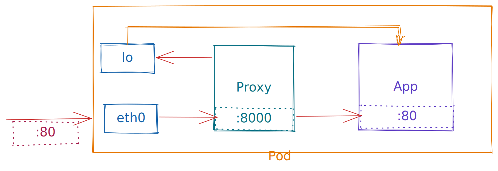

# How to create a simple side car proxy

## Implementation

 - Side car proxy container will intercept the request and re-route the request to intented app container.
 - Side car proxy container sits between the interface and app container.



 - We can reroute the incoming requests to interface to proxy using the `iptables` cmds. [See](./iptables/init.sh)
    - we are running these cmds in an init container.
    - this will put proxy in between interface and app container.
 - When our proxy receives a request at port 8000. [See](./proxy/main.go)
    - it will forward the request to our app at port 80
    - if request was successful, our proxy will return the response

 - We are testing our approach by launch a pod. [See](./k8s/pod.yaml)
 
## Testing

 1. Get the IP of Pod
    - ```bash
        $ kubectl get pods -o wide
        NAME          READY   STATUS    RESTARTS   AGE   IP          NODE             NOMINATED NODE   READINESS GATES
        httpbin-pod   2/2     Running   0          65s   10.1.0.16   docker-desktop   <none>           <none>
        ```

 1. Send a Get request
    -  ```bash
        $ kubectl run -i --rm --restart=Never busybox --image=odise/busybox-curl \
          -- sh -c "curl -i 10.1.0.16:80/get?query=param"
        % Total    % Received % Xferd  Average Speed   Time    Time     Time  Current
                                        Dload  Upload   Total   Spent    Left  Speed
        HTTP/1.1 200 OK
        Access-Control-Allow-Credentials: true
        Access-Control-Allow-Origin: *
        Connection: keep-alive
        Content-Length: 237
        Content-Type: application/json
        Date: Mon, 08 Aug 2022 08:44:55 GMT
        Server: amazing-proxy

        {
        "args": {
            "query": "param"
        }, 
        "headers": {
            "Accept-Encoding": "gzip", 
            "Host": "127.0.0.1:80", 
            "User-Agent": "Go-http-client/1.1"
        }, 
        "origin": "127.0.0.1", 
        "url": "http://127.0.0.1:80/get?query=param"
        }
        100   237  100   237    0     0  28413      0 --:--:-- --:--:-- --:--:-- 29625
        pod "busybox" deleted
        ```
 1. Send a Post request
    - ```bash
        $ kubectl run -i --rm --restart=Never busybox --image=odise/busybox-curl \
          -- sh -c "curl -i -X POST -d 'body=parameters' 10.1.0.16:80/post"
        % Total    % Received % Xferd  Average Speed   Time    Time     Time  Current
                                        Dload  Upload   Total   Spent    Left  Speed
        HTTP/1.1 200 OK
        Access-Control-Allow-Credentials: true
        Access-Control-Allow-Origin: *
        Connection: keep-alive
        Content-Length: 317
        Content-Type: application/json
        Date: Mon, 08 Aug 2022 08:45:29 GMT
        Server: amazing-proxy

        {
        "args": {}, 
        "data": "body=parameters", 
        "files": {}, 
        "form": {}, 
        "headers": {
            "Accept-Encoding": "gzip", 
            "Host": "127.0.0.1:80", 
            "Transfer-Encoding": "chunked", 
            "User-Agent": "Go-http-client/1.1"
        }, 
        "json": null, 
        "origin": "127.0.0.1", 
        "url": "http://127.0.0.1:80/post"
        }
        100   332  100   317  100    15   130k   6339 --:--:-- --:--:-- --:--:--  154k
        pod "busybox" deleted
        ```
1. Send a request to `/status` endpoint.
    - ```bash
        $ kubectl run -i --rm --restart=Never busybox --image=odise/busybox-curl \
          -- sh -c "curl -i http://10.1.0.16:80/status/429"
        % Total    % Received % Xferd  Average Speed   Time    Time     Time  Current
                                        Dload  Upload   Total   Spent    Left  Speed
        0     0    0     0    0     0      0      0 --:--:-- --:--:-- --:--:--     0
        HTTP/1.1 429 Too Many Requests
        Access-Control-Allow-Credentials: true
        Access-Control-Allow-Origin: *
        Connection: keep-alive
        Content-Length: 0
        Content-Type: text/html; charset=utf-8
        Date: Mon, 08 Aug 2022 08:46:55 GMT
        Server: amazing-proxy

        pod "busybox" deleted
        ```
 1. Now check the logs of proxy.
    - ```bash
        $ kubectl logs httpbin-pod --container="proxy"
        Original URL: http://10.1.0.16:80/get?query=param
        Proxy URL: http://127.0.0.1:80/get?query=param
        Request Duration: 6.360182ms
        Request Size: 0
        Response Size: 237
        Response Status: 200

        Original URL: http://10.1.0.16:80/post
        Proxy URL: http://127.0.0.1:80/post
        Request Duration: 1.67244ms
        Request Size: 15
        Response Size: 317
        Response Status: 200

        Original URL: http://10.1.0.16:80/status/429
        Proxy URL: http://127.0.0.1:80/status/429
        Request Duration: 2.356356ms
        Request Size: 0
        Response Size: 0
        Response Status: 429
        ```

We have now implemented the HTTP traffic side car proxy. See original post at https://venilnoronha.io/hand-crafting-a-sidecar-proxy-and-demystifying-istio